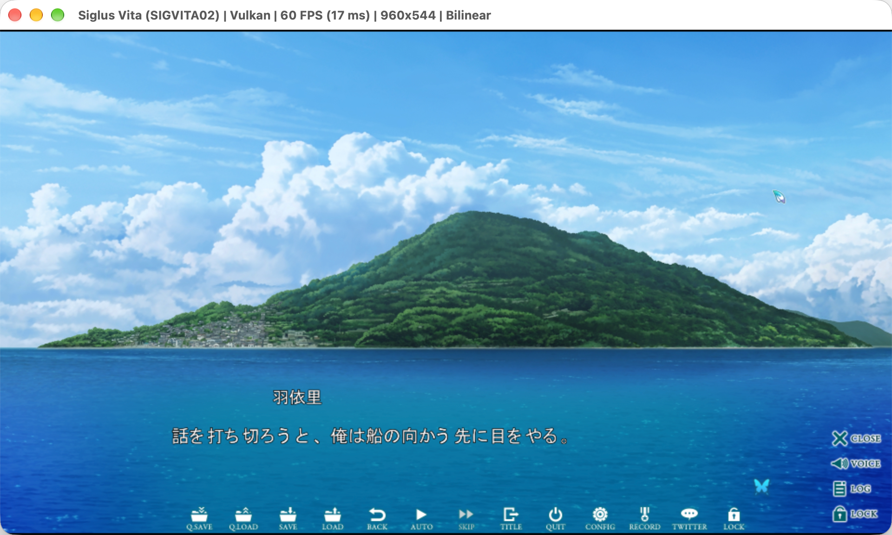
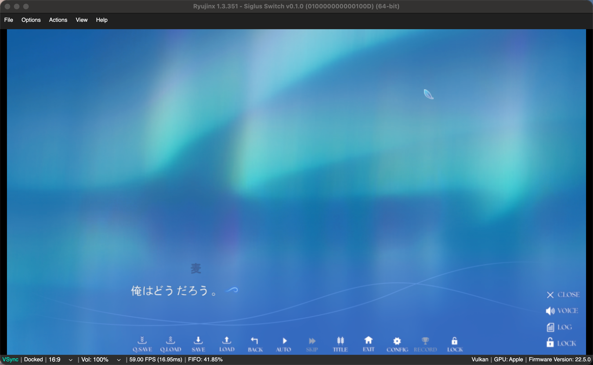

# siglus_rs


**siglus_rs** is an unofficial full Rust reimplementation of **UK2, AVG32, RealLive, and SiglusEngine**, with a primary focus on SiglusEngine.

This project is non-commercial and intended for research purposes.

<br clear="left"/>

## Example screenshots

### UK2 Engine
**1993–1997 · AyPio**

<table>
  <tr>
    <td align="center" width="33%">
      <br>
      <b>Sorcer Kingdom</b><br>
      <sub>Title screen.</sub>
    </td>
    <td align="center" width="33%">
      <br>
      <b>Sorcer Kingdom</b><br>
      <sub>Dialogue scene.</sub>
    </td>
    <td align="center" width="33%">
      <br>
      <b>Sorcer Kingdom</b><br>
      <sub>Map exploration.</sub>
    </td>
  </tr>
</table>


### AVG32
**1996–2001 · VisualArt's**

<table>
  <tr>
    <td align="center" width="33%">
      <br>
      <b>AIR</b><br>
      <sub>The title of AIR.</sub>
    </td>
    <td align="center" width="33%">
      <br>
      <b>AIR</b><br>
      <sub>Air opening.</sub>
    </td>
    <td align="center" width="33%">
      <br>
      <b>Kanon</b><br>
      <sub>Kanon opening.</sub>
    </td>
  </tr>
</table>


### RealLive
**2001–2022 · VisualArt's**

<table>
  <tr>
    <td align="center" width="33%">
      <br>
      <b>Little Busters!</b><br>
      <sub>A screenshot of Little Busters!</sub>
    </td>
    <td align="center" width="33%">
      <br>
      <b>Little Busters!</b><br>
      <sub>The baseball minigame in Little Busters! (implemented in bt00.dll)</sub>
    </td>
    <td align="center" width="33%">
      <br>
      <b>Tomoyo After: It's a Wonderful Life</b><br>
      <sub>The Dungeons & Takafumis minigame in Tomoyo After ~It's a Wonderful Life~ (dt00.dll)</sub>
    </td>
  </tr>
</table>


### SiglusEngine
**2010–now · VisualArt's**

<table>
  <tr>
    <td align="center" width="33%">
      <br>
      <b>macOS</b><br>
      <sub>SiglusEngine running natively on macOS.</sub>
    </td>
    <td align="center" width="33%">
      <br>
      <b>iOS</b><br>
      <sub>SiglusEngine running on iOS.</sub>
    </td>
    <td align="center" width="33%">
      <br>
      <b>WebAssembly</b><br>
      <sub>SiglusEngine running in a web browser.</sub>
    </td>
  </tr>
</table>

<table>
  <tr>
    <td align="center" width="33%">
      <br>
      <b>Chihaya Rolling WE</b><br>
      <sub>Official SiglusEngine benchmark released by Key to measure Rewrite performance.</sub>
    </td>
    <td align="center" width="33%">
      <br>
      <b>Summer Pockets REFLECTION BLUE</b><br>
      <sub>Key’s expanded version of Summer Pockets, adding new routes and a new heroine.</sub>
    </td>
    <td align="center" width="33%">
      <br>
      <b>anemoi</b><br>
      <sub>Key’s 2026 romance adventure title.</sub>
    </td>
  </tr>
</table>

### On game consoles

<table>
  <tr>
    <td align="center" width="33%">
      <br>
      <b>PS Vita</b><br>
      <sub>Summer Pockets REFLECTION BLUE for PS Vita.</sub>
    </td>
    <td align="center" width="33%">
      <br>
      <b>Nintendo Switch</b><br>
      <sub>Anemoi for Nintendo Switch.</sub>
    </td>
  </tr>
</table>

* siglus_rs works on a wide range of platforms, including Windows, Linux, macOS, iOS, Android, and WebAssembly.

| Platform | Targets |
|---|---|
| Linux | x86_64, aarch64 |
| FreeBSD | x86_64 |
| Windows | x86_64, ARM64 |
| macOS | aarch64 app, x86_64 app, universal DMG app bundle |
| iOS | arm64 device, arm64 simulator, x86_64 simulator |
| Android | arm64-v8a, x86_64 |
| WebAssembly | wasm32-unknown-unknown |
| PS Vita | armv7 |
| Nintendo Switch | aarch64 |

The app launchers (macOS bundle, iOS, Android, WebAssembly) import one game or
many games at once, detect the engine (SiglusEngine, RealLive, AVG32, UK2),
show cover art or the game icon, and let you pick the text encoding for
non-Siglus games. See [crates/game_launcher](crates/game_launcher/README.md).

## Pre-built binaries
* See preview releases on [GitHub Releases](https://github.com/xmoezzz/siglus_rs/releases)

## Documentation Availability
* API documentation is available at [docs](https://xmoezzz.github.io/siglus_rs/)
* [PS Vita port](platform/vita/README.md) — experimental SiglusEngine player (`siglus-psvita.vpk` on the releases page); installing it and a game is described there. [Roadmap](platform/vita/ROADMAP.md).

## Run

```bash
cargo run --release -p siglus_scene_vm --bin siglus_engine -- --project-dir ~/Documents/siglus_rs-main/testcase
```

Closing the desktop game window prefers the game's own exit confirmation.
The engine looks for a unique, parameterless exit action in shared script
commands, the configured cancel-menu scene, and the active title menu's local
button actions. Title actions are available only after the title buttons are
ready. Scripts that require EXCALL menu storage, unsupported or ambiguous
scripts, and already active system menus use the built-in confirmation instead.
An optional `#CLOSE_SCENE = "scene_name", label` entry in `Gameexe.ini` overrides
discovery: that scene must handle confirmation and call `syscom.end_game` on
acceptance; returning resumes the game.

Desktop windows use `icon.png`, `icon.ico`, or the first readable `.ico` file
(in filename order) from the game directory, falling back to the Siglus icon.
The engine uses winit `0.31.0-beta.3` to send window icons directly through
`xdg_toplevel_icon_v1` on Wayland compositors that support it. No desktop entry
is generated. Each game retains a separate Wayland application ID.

## Community
If you want to join the development and discussion of this project, you can join the following Discord server:
* Discord: [https://discord.gg/g4rXucPZz3](https://discord.gg/g4rXucPZz3)
* Personally, I only able to speak English, Chinese, Japanese, and very limited French. 


## The `key.toml` configuration file
The `key.toml` file is used to specify different configuration options for siglus_rs. The file should be placed in the root directory of the game project.

### Resource decryption key
* This configuration key for this element is `key`. It is an array of 16 bytes (128 bits) that represents the secondary key.

* SiglusEngine games require a secondary key to decrypt protected resources.

siglus_rs can automatically brute-force the secondary key, but if you want specify the key manually, you can create a `key.toml` file in the game root directory.

There are several practical ways to obtain the key:

1. Static extraction, when the game executable is not encrypted or obfuscated (recommended). The general idea can be found in this repository:

   https://github.com/xmoezzz/siglus_static_key_tool

2. Dynamic extraction. The general idea can be found in this older repository:

   https://github.com/xmoezzz/SiglusExtract

3. Known-key databases maintained by some extractor tools.

Brute-force will be attempted in the following situations:
1. If the key is not specified in the `key.toml` file, siglus_rs will try to brute-force the key.
2. Users specify a wrong key in the `key.toml` file. siglus_rs will try to override the key.
3. If siglus_rs fails to save or overwrite the `key.toml` file, the engine will still execute.

Trial games may not require a secondary key, and in that case, you can specify all-zero key in the `key.toml` file. Here is an example of `key.toml`:

```toml
key = [
  0x00, 0x00, 0x00, 0x00,
  0x00, 0x00, 0x00, 0x00,
  0x00, 0x00, 0x00, 0x00,
  0x00, 0x00, 0x00, 0x00,
]
```

### String Encryption
* This configuration key for this element is `override_string_encryption`. The value of this key can be `xor`, `none`, or `mdl`. The default value is `xor`. 
* In very earlier versions of SiglusEngine, string encryption was not used. 
* However, in later versions (for the most cases), string encryption is enabled by default. 

Explanation of each value:
* `xor`: Enbales the string encryption. This is the default value even if the `override_string_encryption` key is not specified in the `key.toml` file.
* `none`: Disables the string encryption. If you are sure that the game does not use string encryption.
* `mdl`: Automatically detects the string encryption method by using the MDL approach (also see the paper: [https://arxiv.org/abs/cs/0312044](https://arxiv.org/abs/cs/0312044)). It does introduce a performance overhead, but IMO, it's minor.


## License
This project is licensed under the MPL-2.0 License. See [LICENSE](./LICENSE-MPL-2.0) for details.
